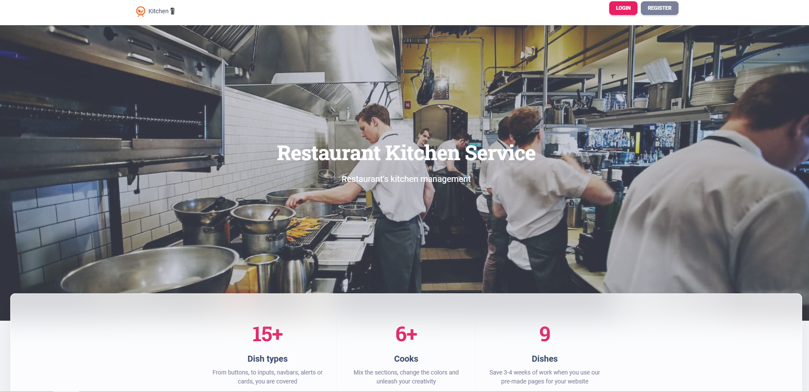
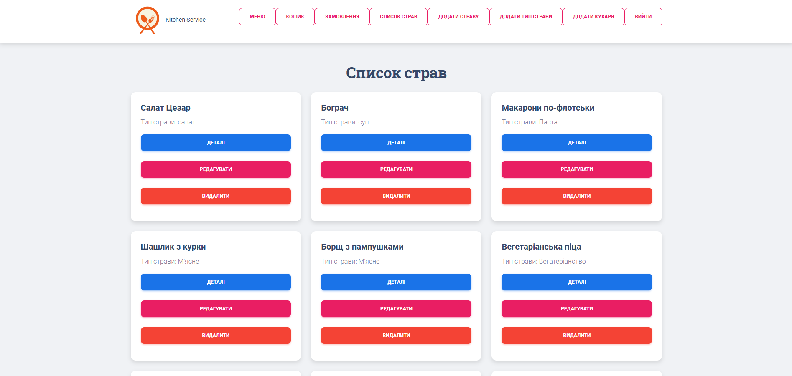
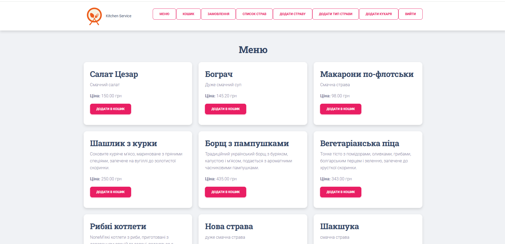
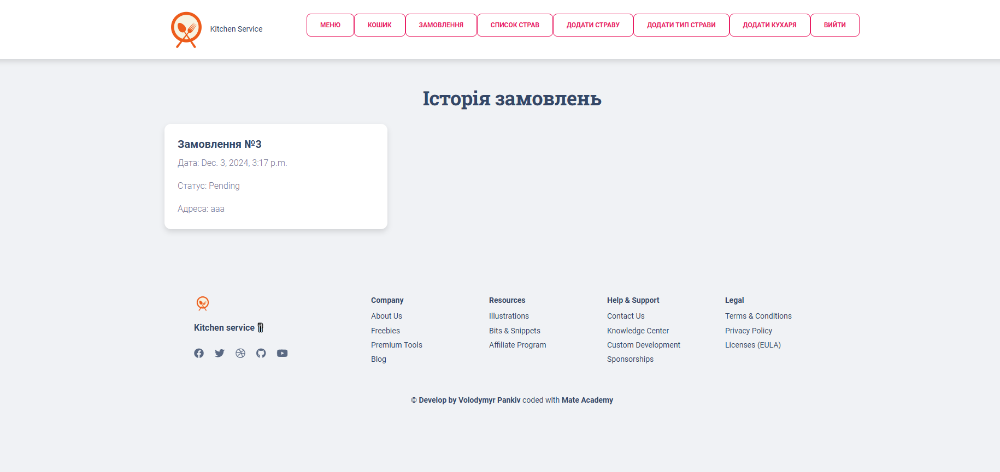
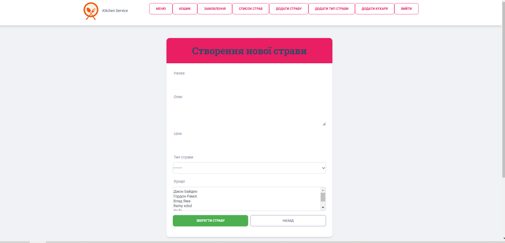

# Restaurant kitchen service

Service for automating the work of a restaurant, chefs, and customers

## Check it out!
Live demo: [Restaurant Kitchen Service](https://restaurant-kitchen-service-mj39.onrender.com)

Test credentials:
* Username: `admin`
* Password: `123654`


## Instalation

Python must be already installed

```shell
git clone https://github.com/spa7id/restaurant-kitchen-service
cd restaurant-kitchen-service
python3 -m venv venv
source venv/bin/activate  # macOS/Linux
venv\Scripts\activate     # Windows
pip install -r requirements.txt
python manage.py migrate
python manage.py runserver
```

## Technologies Used

* Python
* Django
* PostgreSQL
* HTML/CSS
* Bootstrap
* SQLite

## Features

* Ability to create new dishes and chefs responsible for them
* Ordering and delivery
* List of ready meals, shopping cart

## Demo






